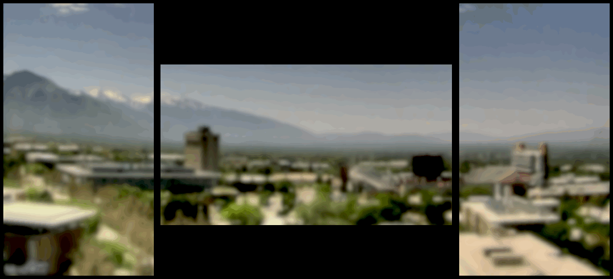

# sky-bg

<p align="center">
  
</p>

Pulls a webcam frame on an interval (JPEG endpoint or the last frame of an MP4/MOV), fits it onto the virtual desktop arrangement, slices out each monitor's region, and sets it as the macOS wallpaper across a multi-monitor setup. Runs as a `launchd` user agent.

Imagery courtesy of the [Horel Research Group](https://horel.chpc.utah.edu/) (MesoWest / University of Utah Department of Atmospheric Sciences, CHPC) — the WBB rooftop camera atop the William Browning Building, looking south over the Salt Lake Valley toward the Wasatch and Oquirrh ranges. Current frame: <https://horel.chpc.utah.edu/data/station_cameras/wbbs_cam/wbbs_cam_current.jpg>.

## Stack

A single compiled Swift binary (`bin/skybg`) does everything image-and-display:

- `URLSession` — JPEG fetch
- `AVFoundation` — `AVURLAsset` + `AVAssetImageGenerator` decode the trailing frame of remote MP4/MOV via HTTP range reads (no full-file download)
- `CryptoKit` — SHA-256 hash of the raw bytes for the "skip if unchanged" fast path
- `CoreImage` — banner crop, virtual-canvas mapping, per-monitor slice, optional `CIGaussianBlur` / `CIMaskedVariableBlur` (gradient stops), `CIColorControls` for saturation/brightness
- `NSScreen` — auto-detect the current display arrangement (no manual config)
- `NSWorkspace.setDesktopImageURL(_:for:options:)` — apply each slice (Apple's official wallpaper API; reliable on every macOS version)
- HEIF 10-bit + Display P3 output (`CIContext.writeHEIF10Representation`) — 1024 values per channel kills the banding 8-bit JPEG produces in smooth sky gradients

Bash is only used for install / dev tooling: `scripts/build.sh`, `scripts/install.sh`, `test/run-once.sh`, `scripts/detect.sh`. No Homebrew / Node / Python deps — every dependency ships in macOS.

## Model

1. Fetch the source. JPEG endpoints are pulled directly; MP4/MOV endpoints go through AVFoundation, which uses HTTP range requests to grab only the moov atom + trailing samples and decode the last frame.
2. SHA-256 the raw bytes; if it matches last cycle's hash, exit early — unless `BLEND_WEIGHTS` has length > 1, in which case every cycle re-renders so the trail toward the latest source keeps advancing. (`install.sh` deletes `output/last-hash` so any config edit forces a re-process.)
3. Archive the source frame into `HISTORY_DIR` as `frame-<timestamp>-<sha>.jpg` and append metadata to `HISTORY_DIR/index.csv` (`timestamp_utc,unix_ms,sha256,file`).
4. If `BLEND_WEIGHTS` has N > 1 entries, composite the current frame with up to N-1 past frames stored in `output/prev-1.jpg … prev-(N-1).jpg`. Layers are stacked oldest-to-newest with αₖ = wₖ / Σ(w₀..wₖ) (`CIColorMatrix` + `CISourceOverCompositing`), which collapses to the exact normalized weighted sum in a single CI graph. After processing, the ring rotates: each `prev-(i-1).jpg` shifts to `prev-i.jpg` and the current raw bytes become `prev-1.jpg`. Missing past frames (cold start) gracefully degrade to a shorter trail. Combined with a short `INTERVAL_SEC` and the heavy default blur, adjacent composites differ by only a few percent — the hard wallpaper swap reads as a smooth continuous fade, despite `NSWorkspace.setDesktopImageURL` having no fade primitive (still true on macOS Tahoe).
5. Trim the top `RAW_CROP_TOP` rows (the webcam's burned-in timestamp banner).
6. Auto-detect every monitor via `NSScreen` (origin in points, pixel size, screen handle).
7. Compute the bounding rect of all monitor frames — that's the virtual canvas.
8. Scale the source onto the canvas per `CANVAS_FIT` (`cover` fills + crops overflow, `contain` letterboxes), pinned per `CANVAS_ANCHOR`.
9. Apply `CIColorControls` (saturation/brightness) and optional blur. `BLUR_RADIUS` accepts a single number (uniform `CIGaussianBlur`) or a comma-separated stop list (`CIMaskedVariableBlur` driven by a vertical gradient mask, e.g. `5,20` = light at top, heavy at bottom).
10. For each monitor, slice the canvas at that monitor's point-rect, resample to its native pixel resolution, and write to `wallpaper-<id>-{A|B}.heic` (alternating slot — fresh path each cycle so the WindowServer refreshes, but bounded "Recent Wallpapers" entries).
11. Apply each slice via `NSWorkspace.setDesktopImageURL` against that monitor's `NSScreen`, dispatched concurrently across displays.

## Layout

```
sky-bg/
├── config.sh                  # defaults sourced by install.sh and test/run-once.sh
├── com.skybg.wallpaper.plist  # launchd template (placeholders substituted by install.sh)
├── scripts/
│   ├── skybg.swift            # the whole runtime pipeline
│   ├── screensaver.swift      # SkyBgScreenSaverView source for the .saver bundle
│   ├── build.sh               # swiftc -O scripts/skybg.swift -o bin/skybg
│   ├── build-saver.sh         # build SkyBg.saver bundle (Developer ID signed)
│   ├── install.sh             # build + render plist + launchctl bootstrap (--unload to remove)
│   ├── install-saver.sh       # copy SkyBg.saver into ~/Library/Screen Savers/
│   ├── detect.sh              # debug: dump the current NSScreen arrangement
│   ├── gen-preview.sh         # render docs/preview.gif (sources config.sh)
│   └── gen-preview.swift      # standalone Swift, animated multi-monitor stitch
├── test/
│   └── run-once.sh            # rebuild + run once (--watch, --no-set)
├── docs/preview.gif           # README artifact rendered by gen-preview.sh
├── bin/skybg                  # built locally, gitignored
├── SkyBg.saver/               # built locally, gitignored
├── output/                    # raw.jpg + wallpaper-<id>-{A|B}.heic + last-hash + history/ (tracked)
└── .logs/                     # launchd stderr log (gitignored)
```

## Configuration

All knobs live in `config.sh` (overridable via env). The binary reads them from its environment at runtime; `install.sh` bakes them into the plist's `EnvironmentVariables` so `launchctl` injects them on every cycle.

| Var                | Default                                                         | Notes                                                             |
|--------------------|-----------------------------------------------------------------|-------------------------------------------------------------------|
| `WEBCAM_URL`       | `http://<thingino-ip>/x/ch0.jpg?token=$WEBCAM_TOKEN`            | JPEG, MP4, or MOV. Video sources decode last frame via AVFoundation |
| `INTERVAL_SEC`     | 10                                                              | launchd `StartInterval`                                           |
| `OUTPUT_DIR`       | `./output`                                                      | stores `raw.jpg`, `last-hash`, and per-display `wallpaper-*` files |
| `HISTORY_DIR`      | `./output/history`                                              | append-only archive of source frames + `index.csv`                |
| `RAW_CROP_TOP`     | 38                                                              | trims camera OSD/banner rows                                      |
| `CANVAS_FIT`       | cover                                                           | `cover` fills (crops overflow) / `contain` letterboxes            |
| `CANVAS_ANCHOR`    | 0.5                                                             | vertical anchor 0..1 (0=bottom, 0.5=center, 1=top)               |
| `BLUR_RADIUS`      | `40,30,40`                                                      | scalar = uniform; comma list = top→bottom gradient stops          |
| `COLOR_SATURATION` | 1.0                                                             | CIColorControls multiplier; 1.0 = unchanged                       |
| `COLOR_BRIGHTNESS` | -0.05                                                           | CIColorControls additive offset; 0.0 = unchanged                  |
| `BLEND_WEIGHTS`    | `1,1,1`                                                         | Comma list of frame weights, most-recent first, auto-normalized. List length N = current + (N-1) past frames composited before blur. `1` = no blend (hard swap, hash-skip on). `1,1` = 50/50 trail. `1,1,1` = last-3 equal blend. `3,2,1` = decaying trail. N>1 disables hash-skip; pair with short `INTERVAL_SEC` for smooth-feeling fades. |
| `LOG_LEVEL`        | info                                                            | `debug | info | warn | error`                                     |

## Webcam source

Default setup is a local Thingino camera snapshot URL and expects `WEBCAM_TOKEN` in `.env` (gitignored). If you want a public no-token source instead, switch `WEBCAM_URL` to WBBS:

```bash
WEBCAM_URL="https://horel.chpc.utah.edu/data/station_cameras/wbbs_cam/wbbs_cam_hour.mp4"
```

## Source endpoint trade-offs

| Source                     | Resolution          | Latency vs real time | Access model           |
|----------------------------|---------------------|----------------------|------------------------|
| Thingino `.../x/ch0.jpg`   | 1920×1080 (main)    | ~1s                  | LAN + token            |
| WBBS `wbbs_cam_hour.mp4`   | 1280×960            | ~12–15 min           | public, no token       |

Flipping `WEBCAM_URL` is enough. `fetchFrameJPEG` dispatches by extension and uses AVFoundation only for video URLs.

## Dev workflow

```bash
chmod +x scripts/*.sh test/*.sh

./test/run-once.sh                      # rebuild + run + apply
./test/run-once.sh --no-set             # skip the wallpaper-set phase (sets SKYBG_NO_APPLY)
./test/run-once.sh --watch              # rebuild + re-run on file change (needs fswatch)
LOG_LEVEL=debug ./test/run-once.sh      # verbose
CANVAS_ANCHOR=1 ./test/run-once.sh      # any env var overrides the config default
./scripts/detect.sh                     # dump current display arrangement
./scripts/gen-preview.sh                # refresh docs/preview.gif from the live MP4
```

`gen-preview.sh` is a separate dev tool — it sources `config.sh` so the rendered canvas (fit/anchor/blur/color) matches the live wallpaper, but it doesn't touch `bin/skybg`, `output/`, or the launchd agent. It defaults to `wbbs_cam_day.mp4` (the 24h time-lapse, ~58 MB) regardless of `config.sh`'s `WEBCAM_URL`, then samples a `GIF_SPAN_FRAC` window (default 0.5 → ~12h) centered at `GIF_SPAN_CENTER` of the timeline (default 0.7 → afternoon→sunset arc) so a single loop captures the most visually dynamic stretch without the dark-of-night extremes. Tunables (env-overridable):

| Var                | Default | Notes                                                    |
|--------------------|---------|----------------------------------------------------------|
| `WEBCAM_URL`       | day mp4 | any MP4/MOV; runtime `config.sh` value can be overridden |
| `GIF_FRAMES`       | 36      | total frames sampled across the window                   |
| `GIF_DELAY_MS`     | 120     | per-frame delay; loop length = frames × delay            |
| `GIF_SPAN_FRAC`    | 0.5     | fraction of source timeline to cover (0..1)              |
| `GIF_SPAN_CENTER`  | 0.7     | where that window sits (0=video start, 1=video end)      |
| `GIF_TARGET_WIDTH` | 1100    | output width in px; height auto-derived from canvas      |
| `GIF_BEZEL_PX`     | 6       | gap drawn around each monitor slice                      |
| `GIF_OUT`          | `docs/preview.gif` | output path (relative to repo root)           |

## Install

```bash
./scripts/install.sh           # builds bin/skybg, copies plist, bootstraps the agent
./scripts/install.sh --unload  # bootout and remove
```

The agent runs at load and every `INTERVAL_SEC`. Logs land in `.logs/stderr.log`.

After editing `config.sh`, re-run `./scripts/install.sh` to re-render the plist and reload. (It also `unset`s any inherited env vars first so leftover shell exports don't leak into the agent.)

## Screensaver (optional)

A companion `.saver` bundle (`SkyBg.saver`) shows the same per-monitor slice during screensaver mode, so the wallpaper region stays pixel-identical when macOS activates/deactivates the screensaver. You'll still see the standard system fade and chrome (dock, icons, windows) appearing/disappearing — those aren't suppressible — but the background image content is continuous.

Requires a **Developer ID Application** certificate in your login keychain (free with Apple Developer enrollment; create via Xcode → Settings → Accounts → Manage Certificates → +). `build-saver.sh` auto-detects the first one. macOS Sequoia/Tahoe `amfid` rejects ad-hoc-signed `.saver` bundles, so this is non-optional.

Build, install, and pick it once:

```bash
./scripts/build-saver.sh                          # compiles + signs with your Developer ID
./scripts/install-saver.sh                         # copies into ~/Library/Screen Savers/
open 'x-apple.systempreferences:com.apple.Lock-Screen-Settings.extension'
# scroll to Screen Saver, pick "SkyBg"
```

Per-monitor slice discovery uses `NSWorkspace.shared.desktopImageURL(for:)` — the screensaver simply asks the system "what wallpaper is currently set on this screen?" and loads that file. No shared state files, no path discovery, sidesteps the screensaver-sandbox `~` redirect.

After editing `screensaver.swift`, rebuild + reinstall + force the daemons to pick up the new bundle:

```bash
./scripts/build-saver.sh && ./scripts/install-saver.sh
killall WallpaperAgent legacyScreenSaver Wallpaper WallpaperLegacyExtension 2>/dev/null
```

## Notes

- Display arrangement is detected on every cycle, so plug/unplug/rearrange just works.
- `NSWorkspace.setDesktopImageURL` is the official wallpaper API and does not have the path-cache bug that `osascript`'s `set picture of desktop` has on macOS 14+. We still alternate filenames between an `-A` and `-B` slot per display so the WindowServer (which caches at a deeper layer) treats each cycle as a fresh path.
- Cold-start cost: a `swiftc -O` binary launches in ~10 ms; AVFoundation video-frame decode is ~0.4–0.6 s; full cycle wall time ~1–3 s depending on network. The hash-skip path bypasses everything past the fetch (~150 ms total).
- Output is HEIF 10-bit Display P3 (`writeHEIF10Representation`), file size typically smaller than the equivalent 8-bit JPEG.
